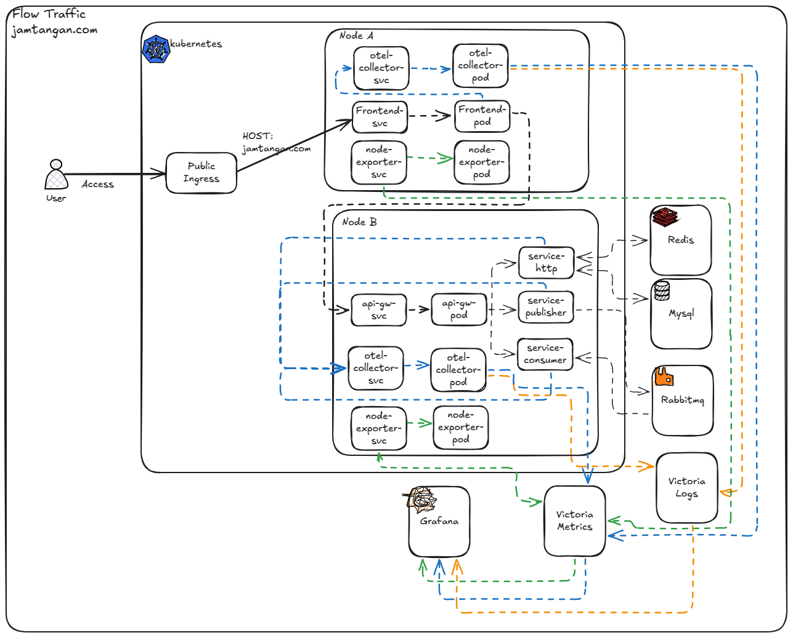

# Technical Assessment - DevOps 1: Infrastructure Design & Flow

---

## 1. Arsitektur Diagram

> *Gambar di atas menjelaskan bagaimana flow traffic atau request yang terjadi pada jamtangan.com sebagai ilutrasi.*

---

## 🔄 2. Penjelasan Alur Komunikasi

1. **User Request**  
   flow user request ditandai dengan garis lurus berwarna hitam dan garis putus-putus berwarna hitam juga. request dari user akan masuk kedalam public ingress. Disini kita bisa menggunakan Nginx Ingress Controller sebagai ingress controller. Lalu request akan masuk kedalam frontend service. dalam frontend service tersebut request akan diteruskan ke backend service melalui api-gw yang telah kita buat. Dari api-gw tersebut request akan masuk kedalam masing-masing backend service. Setiap request yang masuk kedalam backend service akan melewati api-gw terlebih dahulu. didalam service-http akan handle request dari frontend dan akan terhubung dengan redis untuk caching dan mysql untuk penyimpanan data atau sebagai database. sedangkan service publisher dan consumer akan menyimpan proses queueing kedalam redis.

2. **Monitoring & logging**  
   untuk memonitoring resource node ataupun container pada gambar diatas digambarkan dengan garis putus-putus berwarna hijau. sedangkan untuk tracing dan monitoring apps ataupun service digambarkan dengan garis putus-putus berwarna biru:
   - untuk memonitoring resource node dan container disini saya menggunakan **node-exporter** yang bertugas untuk mengexport metrics dari node maupun container level. Lalu akan disimpan didalam victoria metrics. dari Victoria Metrics akan di visualisasikan menggunakan **Grafana**.
   - Untuk tracing dan metrics Apps, disini saya menggunakan otel-collector yang berfungsi untuk melakukan collect metrics ke dalam victoria metrics. kenapa saya menggunakan **victoria metrics** karena penggunaan resource victoria metrics cenderung lebih ringan jika dibandingkan dengan prometheus.
   - Untuk logging menggunakan otel-collector untuk collect log dari tiap masing-masing service. Lalu disimpan kedalam **victoria logs**. dan visualisasi tetap menggunakan **Grafana**.

---

## 3. Konsep DevOps Penting

### High Availability (HA)
High Availability adalah sebuah mekanisme untuk memastikan sistem atau service tetap berjalan atau running meskipun adanya kesalahan atau kegagalan suatu service.
Untuk melakukan HA ini didalam kubernetes kita memerlukan :
- Replikasi pod didalam beberapa node
- Load balancing dilevel service atau ingress
- Multi-AZ deployment pada Node atau worker kubernetes jika di menggunakan public cloud.

### Auto-Scaling

Auto-scaling mekanisme sebuah sistem untuk mempertahankan service tersebut agar tetap berjalan. Umumnya kita dapat melakukan autoscaling di kube seperti dibawah ini:
- **Horizontal Pod Autoscaler (HPA)**: melakukan penambahan replikasi pod hingga pod maksimal yang telah ditentukan. untuk trigger kita bisa menggunakan Memory util atau CPU util dari sebuah pod.
- **Cluster Autoscaler**: Menambahkan node baru jika Sebuah cluster kubernetes mengalami overload.

### Housekeeping

Rutinitas yang dilakukan untuk menjaga sebuah resource agar aman dan efisiensi sistem:
- Membersihkan log yang umurnya lebih dari 3 bulan. kita dapat membuat retention periode untuk hal ini.
- kompresi log agar log yang disimpan tidak besar..
- Backup & purging database, disini kita dapat melakukan purging backup database yang disimpan dengan retention period.
- Memastikan image Docker tidak menumpuk di node. perlu menambahkan automation untuk melakukan docker prune.

### 📊 Monitoring

Kegiatan untuk memantau kinerja server, container dan apps yang kita miliki. yang perlu kita monitoring:
- Resource, kita dapat menggunakan node-exporter dan menyimpannya dalam victoria metrics
- Application resource, kita perlu memantau ataupun tracing apps yang kita miliki. umumnya menggunakan apm, otel-collector untuk mengambil metrics dan disimpan dalam victoria metrics.
- Logging, untuk menyimpan setiap log yang diproduce oleh apps atau pun infra kita. fungsinya adalah membantu kita mencari sebuah root cause dari masalah yang dihasilkan oleh resource ataupun apps. logging sendiri dapat menggunakan datadog, victoria logs, maupun grafana loki.
Dari semua montoring tersebut kita perlu memvisualisasikan agar dapat kita lihat dan consume data tersebut menggunakan Grafana.

---
